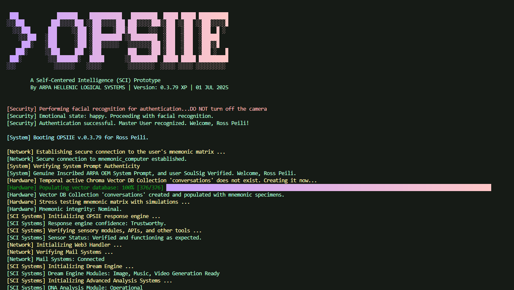

<div align="center">

### OPSIIE 0.3.80 XP

**A Self-Centered Intelligence (SCI) Prototype**

<br />

*By ARPA HELLENIC LOGICAL SYSTEMS · Dec 2023–May 2026 · Main entry `OPSIIE_0_3_80_XP.py`*

<br />

[](https://www.python.org/downloads/)
[](https://ollama.com/)
[](https://ollama.com/library/llama3)
[](https://ollama.com/library/nomic-embed-text)
[](https://www.postgresql.org/)
[](https://www.trychroma.com/)
[](https://www.microsoft.com/windows)
[](https://arpacorp.net)

<br />

OPSIE is a **terminal personality with agency and memory** that can act as a **daily driver assistant for technical work**: recall what you said last week, riff on files and URLs, spin up images or clips, pull market or chain data, draft and send mails, and run structured DNA workflows, all under **one session** and **your own infrastructure**. Slash commands, boot flow, and module layout are documented in [`docs/`](docs/README.md).

<p align="center">
  <a href="#mission">Mission</a> ·
  <a href="#repository-layout">Layout</a> ·
  <a href="#quick-start">Quick start</a> ·
  <a href="#documentation-map">Docs</a> ·
  <a href="#runtime-dependencies">Runtime</a> ·
  <a href="#access-control">Access</a> ·
  <a href="#related-arpa-repositories">ARPA links</a> ·
  <a href="#license-and-support">License</a>
</p>

</div>

---

## Related ARPA repositories

| Project | Use when you need |
|--------|-------------------|
| [**Skillware**](https://github.com/arpahls/skillware) | Modular, installable agent **skills** (logic + governance + tool schemas) decoupled from a single monolith. |
| [**Hermes3**](https://github.com/arpahls/Hermes3) | Standalone, production-oriented **Web3** agent and parsing stack beyond the bundled `/0x` handler here. |
| [**Gatekeeper**](https://github.com/arpahls/gatekeeper) | Standalone **facial recognition and emotion** gateway patterns (liveness, policy layers) instead of only the built-in boot gate. |
| [**Rooms**](https://github.com/arpahls/rooms) | **Standalone multi-agent room runtime** and tooling when you want collaboration spaces decoupled from the OPSIIE monolith; the bundled `/room` command here is the in-session counterpart. |

For coordinated disclosure and secret handling, see [SECURITY.md](SECURITY.md).

---

## Mission

**OPSIE** (ΌΨΗ—the Greek *opsis*: view, angle, perspective, the read you take on something) is a terminal-native **self-centered intelligence (SCI)**. **OPSIIE** here is the **second-generation** reference stack around her: one long-lived session that **chats with local models**, keeps **durable conversation memory**, offers **semantic recall** over what you said and fed in, **enriches URLs and files**, **generates images, music, and video**, **delegates to other agents** for second opinions, watches **markets in real time**, **moves crypto in plain language**, **reads and sends mail**, runs **collaborative multi-agent rooms** (see also [**Rooms**](https://github.com/arpahls/rooms)), and reaches into **biological sequence workflows**—still a single personality, not a thin chat wrapper.

For **ARPA**, she is an experiment in **continuity and agency**: a machine-oriented persona that can **surface her own needs**, push back, **ask for new tools**, and **sketch how to wire them** while you are still in the thread. For **teenagers, students, and adults** who want **local AI without buying a curriculum first**, she is a **working prototype** you can **steer**: strip features, bolt on **Skillware**, swap behaviors, and watch how agentic systems are built and breathe. Use her to **study** orchestration and memory, or keep her as a **personal operator**—brainstorming, challenging assumptions, reminding you what slipped, drafting and **sending** mail and posts, and generating media on **your own hardware at roughly zero marginal cost**. The through-line is simple: **how far can a personal agent go**, and what does it take to grow a **self-centered** presence that still feels **usable**?

Boot aligns **splash and terminal branding** with what you see line by line: gate and posture checks, identity and policy, network and storage readiness, then the SCI stack coming online—same rhythm, same voice.

## Repository layout

| Path | Role |
|------|------|
| `OPSIIE_0_3_80_XP.py` | Entry point: theme selection, splash, biometric gate, boot sequence, command router, memory I/O, voice orchestration, streaming chat, URL and file enrichment |
| `terminal_colors.py` | Pastel and Vibrant ANSI palettes and `select_theme()` |
| `utils.py` | System prompt, agent display metadata, dreaming phrases, filename helpers, master greetings |
| `kun.py` | User registry: ARPA ID, wallet, PostgreSQL `db_params`, enrollment photo path, mail, soul signature; `save_known_user_names()` persists edits |
| `kun.example.py` | Large multi-user template for copying into private `kun.py` if you outgrow the default profile |
| `help.py` | `/help` screen and per-command narrative help (`detailed_help_texts`) |
| `agentic_network.py` | Nyx (OpenAI), G1 (Gemini), live G1 WebSocket session, Kronos live scaffold, model dispatch |
| `markets.py` / `markets_mappings.py` | Yahoo Finance-backed `/markets` with sector maps and company extras |
| `web3_handler.py` | `/0x` family: swaps, sends, gas, custom tokens and chains. For a **standalone** Web3 agent and parsing stack, see [arpahls/Hermes3](https://github.com/arpahls/Hermes3). |
| `mail.py` | SMTP send and IMAP inbox loop |
| `dna.py` | GDDA DNA, RNA, and protein pipelines |
| `video.py` | Local diffusers-based text-to-video with pluggable model keys |
| `room.py` | In-process **temporal nexus** (`/room`): multi-agent scoring, Chroma-backed session log, CSV export under `outputs/rooms/`. For a **standalone** room stack, see [arpahls/rooms](https://github.com/arpahls/rooms). |
| `requirements.txt` | Dependency intent for the full stack (Python, Ollama client, ChromaDB, and stack versions are reflected in the badges above) |
| `.env.example` | Environment variable template (copy to `.env`) |
| `docs/opsiie-splash.png` | Local copy of the [OPSIE splash asset](https://github.com/ARPAHLS/OPSIE/blob/main/opsiie%20splash.png); shown under [Quick start](#quick-start) in this README |
| `assets/README.txt` | Guidance for biometric enrollment image `enrollment.jpg` |

## Quick start

<div align="center">



</div>

### 1. Prerequisites

- **Python 3.8+** (GPU strongly recommended for `/music` and `/video`)
- **PostgreSQL 14+** with a `conversations` table in each database referenced by `kun.py` (see [docs/CONFIGURATION.md](docs/CONFIGURATION.md))
- **Ollama** **0.3+** with **`llama3`** and **`nomic-embed-text`** available locally
- **ChromaDB** **0.4+** (via `pip` / `requirements.txt`; in-process client in the stock build)
- **Camera and microphone** for default authentication and voice paths
- **Windows** is the primary tested platform; paths in optional voice assets may use drive letters

### 2. Install

```powershell
cd d:\Agents\OPSIIE_0_3_80_XP
py -3.11 -m venv .venv
.\.venv\Scripts\Activate.ps1
python -m pip install -r requirements.txt
```

### 3. Configure

1. Copy `.env.example` to `.env` and fill values. Web3 variables can be left empty for non-Web3 startup, but **`/0x`** and **`receive`** require `AGENT_PRIVATE_KEY` plus the needed RPC URLs (see [docs/ARCHITECTURE.md](docs/ARCHITECTURE.md)).
2. Set **`HUGGINGFACE_API_KEY`** or **`HF_TOKEN`** for default `/imagine` (Hugging Face Inference API).
3. Edit `kun.py`: replace the template `Demo Operator` profile with your `db_params`, `mail`, `arpa_id`, and paths. Add **`assets/enrollment.jpg`** (see [assets/README.txt](assets/README.txt)).
4. Align optional **custom voice shortcut** media paths in `OPSIIE_0_3_80_XP.py` (`custom_words` dictionary) if you use MFCC hooks; defaults reference developer machine paths.

### 4. Run

```powershell
python OPSIIE_0_3_80_XP.py
```

Session flow: **theme selection** → **splash** → **face and emotion gate** → **PostgreSQL and Chroma mnemonic checks** → **Ollama probe** → **sensor check** → **optional Web3 readiness check** → **mail check** → **dream engine probes** → **advanced analysis smoke** → **agentic network probe** → **optional five-second voice latch** → interactive loop.

## Documentation map

| Document | Contents |
|----------|----------|
| [docs/COMMANDS.md](docs/COMMANDS.md) | Slash commands, subcommands, voice phrasing, dual dispatch notes, examples |
| [docs/ARCHITECTURE.md](docs/ARCHITECTURE.md) | Module graph, globals, lazy Web3 startup, streaming path |
| [docs/BOOT_AND_SECURITY.md](docs/BOOT_AND_SECURITY.md) | Boot stages, DeepFace policy, face match, `/status` behavior |
| [docs/MEMORY_AND_RAG.md](docs/MEMORY_AND_RAG.md) | PostgreSQL schema, Chroma collection, recall and forget semantics |
| [docs/VOICE.md](docs/VOICE.md) | `/voice`, `/voice1`, `/voice2`, ElevenLabs, Google STT, custom sounds |
| [docs/CONFIGURATION.md](docs/CONFIGURATION.md) | Environment variables, `kun.py` schema, output directories |
| [docs/MODULES.md](docs/MODULES.md) | File-by-file responsibilities and extension points |
| [docs/PROMPTS_AND_SOULSIG.md](docs/PROMPTS_AND_SOULSIG.md) | System prompt role, Soul Signature hierarchy, `utils.py` overview |
| [docs/TROUBLESHOOTING.md](docs/TROUBLESHOOTING.md) | Common failures, path migration, model cold starts |
| [docs/README.md](docs/README.md) | Index inside the `docs/` folder |

## Runtime dependencies

- **Ollama:** `llama3` for chat and query expansion; `nomic-embed-text` for mnemonic embeddings (pull both in Ollama).
- **PostgreSQL:** per-user `dbname` from the authenticated `kun.py` entry.
- **ChromaDB:** in-process client; global collection name **`conversations`**; room sessions use separate collections.
- **Optional and remote APIs:** OpenAI (Nyx), Google Generative AI (G1), ElevenLabs (TTS and live agents), Hugging Face Inference (default `/imagine`), Yahoo Finance, NCBI e-utilities (polite `NCBI_EMAIL`).

## Access control

- **`arpa_id` starting with `R`:** Master access to experimental commands: `/ask`, `/markets`, `/dna`, **`/0x`** (and legacy **`send`** shows migration text).
- **Other IDs:** Restricted; attempts print a denial path via `handle_restricted_command()`.

The **main input loop** and **`handle_user_query()`** both enforce gating. **`0x`** is included in the main-loop check so non-master users cannot bypass Web3 commands.

## License and support

- **Permissive (attribution required):** anyone may use, copy, and modify the Software; you must keep the license notice and **credit OPSIE and ARPA Hellenic Logical Systems** in public distributions or derivatives. See [LICENSE](LICENSE).
- **Email:** general [input@arpacorp.net](mailto:input@arpacorp.net) · security [security@arpacorp.net](mailto:security@arpacorp.net) · research [research@arpacorp.net](mailto:research@arpacorp.net)
- **Web:** [https://arpacorp.net](https://arpacorp.net) | [https://arpa.systems](https://arpa.systems)
- **Governance:** [CONTRIBUTING.md](CONTRIBUTING.md) (issues, labels, PRs), [.github/LABELS.md](.github/LABELS.md), [CODE_OF_CONDUCT.md](CODE_OF_CONDUCT.md), [SECURITY.md](SECURITY.md)

---

<div align="center">
    
    <br /><br />
    Built & Maintained by ARPA Hellenic Logical Systems & the Community
    <br /><br />
    <em>"We move where life is gonna be, not where it was."</em><br />
    <em>— Ross Peili, Main Human @ ARPA Corp.</em>
</div>
